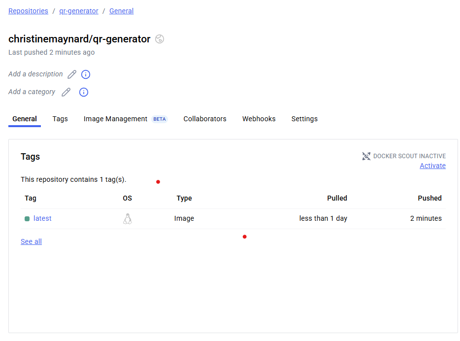

##  QR Generator App

This app uses Docker to generate a customizable QR code 

##Checkout my Github using the QR code below!

##  Screenshot of Docker logs:

This image shows the logs of the container successfully generating the QR code.
